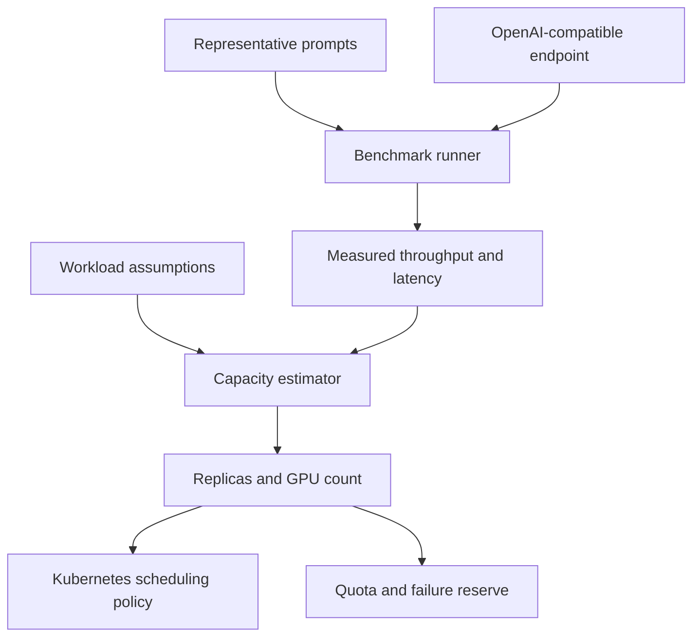

# Architecture

The repository separates planning from measurement because a GPU model name alone cannot predict inference capacity.

## Components

- `calculator.py` estimates model-weight memory, KV cache per request, token demand, replicas, and GPUs.
- `benchmark.py` sends concurrent requests to an OpenAI-compatible inference API and captures token throughput and latency. It also samples local NVIDIA utilization and memory when `nvidia-smi` is available.
- `app.py` exposes the calculator as a FastAPI service with health and Prometheus endpoints.
- `cli.py` supports repeatable estimates and benchmarks from JSON input files.
- `deploy/` contains a CPU-only deployment, an optional GPU overlay, an OpenShift Route, and policy examples.

## Deliberate boundaries

The calculator does not claim that every model with the same parameter count performs equally. Kernel selection, quantization method, batch policy, context length, serving runtime, interconnect, GPU topology, and model architecture all influence results. The benchmark supplies the throughput value used for a production estimate.

The default pod does not request a GPU. It can estimate capacity and benchmark a remote inference endpoint without reserving an accelerator. The optional GPU overlay exists for demos that require direct GPU access.
